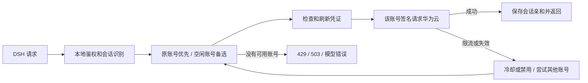

# CodeArts Account Pool

面向 Windows 和 DSH 等 OpenAI 兼容客户端的本地 CodeArts 账号池。使用者通过华为官方页面登录自己的账号，代理保存独立凭证，在上游限流、并发受限或账号失效时尝试其他账号，并尽量保持同一会话使用同一账号。

基于 [HITZY2002/codearts2api](https://github.com/HITZY2002/codearts2api) 修改，保留 MIT 许可证和上游版权。详见 [NOTICE](NOTICE.md) 和 [上游原始说明](docs/upstream-readme.md)。

**当前版本支持账号切换，不保证 DSH 永不中断。** 所有账号同时不可用时仍会返回错误；内部排队、等待恢复和连接心跳尚未实现。本项目不是华为或 DeepSeek 官方产品。

## Windows：下载后双击安装

1. 从 [Releases](https://github.com/tobyberry666/codearts-account-pool/releases) 下载 `codearts-account-pool-v0.1.0-windows-amd64.zip`，完整解压到任意目录。GitHub 的 Source code ZIP 不含可执行程序。
2. 双击 `Install.cmd`。默认安装到 `%USERPROFILE%\.codearts2api`，生成随机本地 API Key，并创建桌面上的启动、停止、账号管理入口。正常安装使用当前用户后台任务，不安装系统服务。
3. 双击 **CodeArts 账号管理.cmd**，选 `1` 添加账号。添加不同账号前，在浏览器退出当前华为账号。密码和验证码只填写在官方登录页面。每个账号需拥有相应模型权益；重复登录不会增加额度。
4. 在客户端填写下表。密钥在安装目录的 `connection.txt`，不要把这个文件发给别人。

| 设置 | 值 |
|---|---|
| 协议 | OpenAI Chat Completions |
| Base URL | `http://127.0.0.1:7866/v1` |
| API Key | `connection.txt` 中生成的本地密钥 |
| 模型 ID | `deepseek-v4.1-flash`、`deepseek-v4-pro-0813` 或账号实际拥有的模型 |

DSH 没有 CodeArts 提供商条目时，使用支持自定义 Base URL 的 OpenAI 兼容配置。API Key 是本地代理密钥，不是华为账号密码。不要依赖模型在回答中自报身份；查看请求模型和日志中的实际路由账号。

### 账号管理菜单

- `1` 添加账号；`2` 为选定账号重新登录；`3` 安全重启并查看状态；`0` 退出菜单，后台代理继续运行。
- 登录或重载前等待活跃请求结束，然后暂停代理，完成后自动恢复，避免旧后台刷新覆盖新凭证。请先结束 DSH 当前任务。
- 同一已识别云端身份不会计为两个账号。无法取得身份时会提示，多个本地文件不代表多份独立额度。
- 首次登录后可请求 `/v1/models` 刷新模型目录。`benefit_auto_claim` 在该路径触发福利领取；它不是午夜定时领取任务。福利规则以提供方为准。

### 启动、停止和更新

开机后双击 **CodeArts 启动代理.cmd**。关闭启动窗口不会停止后台代理；需要停止时用停止入口。默认没有添加开机触发器。

升级前结束任务并停止代理，解压新版本后运行 `Install.cmd`。安装器保留已有配置、API Key、账号和状态，备份旧程序；如果代理仍运行则拒绝覆盖。脚本运行权限问题见 [排错说明](docs/troubleshooting.md)。

## 实际工作原理



- 默认每账号一个并发槽位，多个账号可各自处理请求。不会控制官方 CodeArts 客户端的流量。
- 有明确会话 ID 时优先使用；没有时从首条用户消息推导。相同首条消息可能共用亲和标识。
- 每个受限账号在一轮调度中尝试一次；401 成功刷新后可以重试一次。
- 已开始流式输出的回答不会换号重放，避免重复输出和工具调用。
- 保持账号和会话 ID 不等于保证缓存命中；每轮仍携带完整历史。代理使用量可能是上游值，也可能是估算，不能当作福利扣费账单。

详细代码路径与限制见 [架构说明](docs/architecture.md)。

## 从源码构建

需要 Go 1.22 或更高版本；无需 npm、Python 或第三方 Go 依赖。

```powershell
go test ./...
go build -o bin/codearts2api.exe ./cmd/server
go build -o bin/codearts-login.exe ./cmd/login
powershell -NoProfile -ExecutionPolicy Bypass -File scripts/build-release.ps1 -Version v0.1.0
```

构建脚本会运行测试，再生成 Windows ZIP 和 `SHA256SUMS.txt`。发布脚本只复制明确允许的程序与文档，不打包 `auths`、`data`、`config.json`、日志或个人连接信息。源码包由已审查的 Git 提交生成。

高级用法：`windows/install.ps1 -ProfileDir <目录> -PrepareOnly` 仅准备文件，不创建任务、桌面入口或启动代理；适合测试或手动运行。`bin/codearts2api.exe -config <目录>/config.json` 可前台运行。

## 已知限制与边界

- 没有实现实时额度余额调度、每日额度用尽后冻结到次日、全部账号受限后内部等待恢复；DSH 耗尽自身重试后仍可能停止。
- 登录自动刷新依赖有效 refresh token 和原 DPoP 密钥；刷新凭证失效时需要重新登录。
- 上游 API、模型、并发限制和福利活动可能变化。官方福利活动注明仅限 CodeArts 内使用，外部接入不属于官方支持路径：[活动页面](https://activity.huaweicloud.com/codearts_agent.html)、[福利说明](https://support.huaweicloud.com/offers-codeartsagent/codeartsagent_offers_0001.html)。
- 上游保留的 Web 管理页面仍在项目中；Windows 账号更新建议使用桌面菜单的停机更新流程。运行时直接重载凭证的并发安全仍待改进。

## 安全与贡献

默认只监听本机。`auths` 中包含敏感凭证，`connection.txt` 含本地密钥；不要上传、分享或放进公共同步目录。提交 Issue 时只提供脱敏错误，不提供原始配置、凭证或完整日志。

贡献请运行 Go 测试；修改 Windows 安装器还需运行 `windows/test-install.ps1`。回归测试使用临时假凭证和本地模拟服务，CI 不需要真实账号。

MIT License，保留上游版权；发布内容不包含维护者的账号或密钥。
